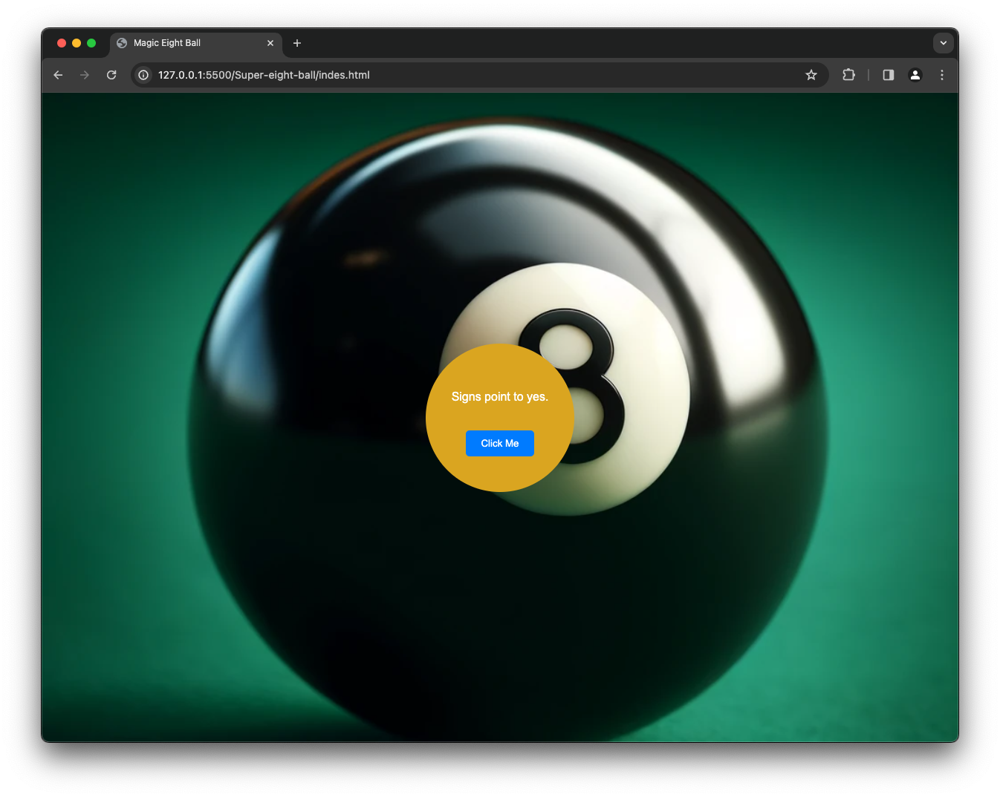

The Mystic 8 Ball is a web app that mimics the classic fortune-telling toy. Users can ask questions and receive mysterious answers in a simple and engaging interface. Built with ReactDOM and JavaScript for seamless interaction.

HOW TO RUN 
------------------------------------
* To get started, navigate to the Super-eight-ball repository on GitHub and download the files. Then, open the folder in Visual Studio Code and launch the live server extension. This action  will automatically open the project in your default web browser.

TECHNOLOGY STACK USED
------------------------------------
* HTML
* CSS
* JavaScript
* reactDOM

